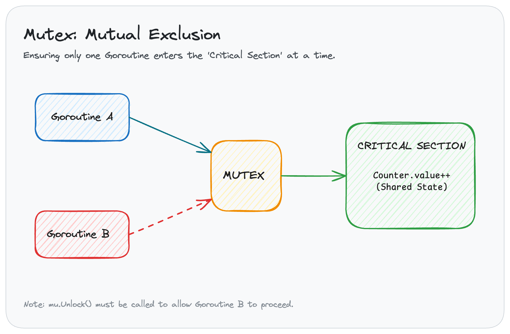
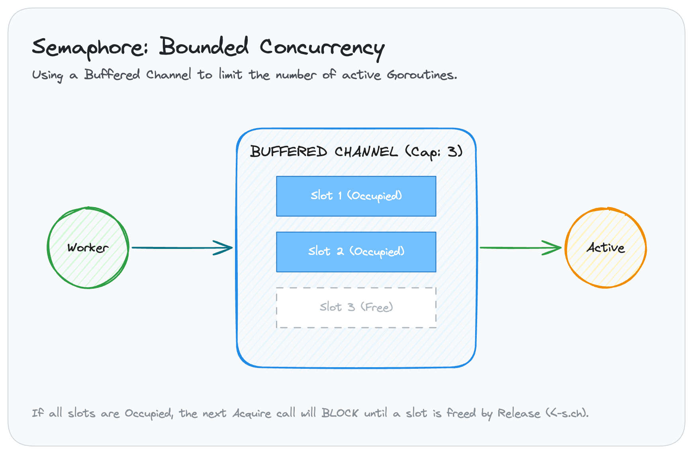
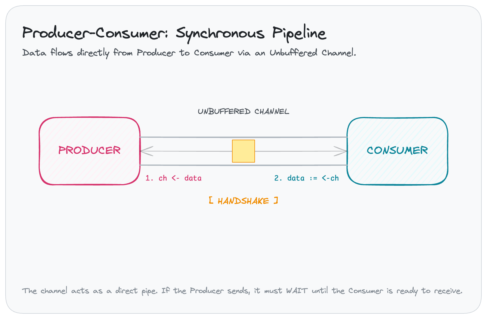

# go-ipc-sync-lab

Practical Go implementations of IPC and synchronization primitives for *Fondamenti di Informatica*.

---

## Patterns

| Pattern | Use Case | Go Primitive |
|---|---|---|
| **Mutex** | Protect a single variable/struct from simultaneous writes. | `sync.Mutex` |
| **Semaphore** | Limit total concurrent goroutines (e.g. max 5 API calls). | `chan struct{}` (Buffered) |
| **Prod-Cons** | Decouple "data creation" from "data processing". | `chan T` (Unbuffered) |

---

## Visualizing Concurrency

### 1. Mutex (Mutual Exclusion)
**The Problem**: Multiple goroutines trying to update the same variable at the same time cause a "Race Condition" where updates are lost.
**The Solution**: A `sync.Mutex` acts like a "single key" to a room. Only the goroutine with the key can enter the **Critical Section**.



**Key Logic**:
*   **Lock**: `mu.Lock()` — Acquire the "key". Blocks others.
*   **Unlock**: `mu.Unlock()` — Return the "key". Allows the next person in.

**Example Code**:
```go
var (
    mu    sync.Mutex
    count int
)

// In a goroutine:
mu.Lock()
count++         // Safe update
mu.Unlock()
```

*   **Goal**: Prevent data corruption in shared state.

### 2. Semaphore (Bounded Concurrency)
**The Problem**: Launching 10,000 goroutines to call an API might crash the server or exhaust system resources.
**The Solution**: Use a **Buffered Channel** as a "Worker Pool". The channel capacity defines the max number of concurrent workers allowed.



**Key Logic**:
*   **Acquire**: `ch <- struct{}{}` — Take a slot in the pool. Blocks if pool is full.
*   **Release**: `<-ch` — Give a slot back to the pool.

**Example Code**:
```go
// Pool with 3 slots
sem := make(chan struct{}, 3)

for i := 0; i < 10; i++ {
    go func() {
        sem <- struct{}{}    // Acquire slot
        doWork()             // Max 3 at a time
        <-sem                // Release slot
    }()
}
```

*   **Goal**: Limit resource usage and prevent system overload.

### 3. Producer-Consumer (Pipeline)
**The Problem**: You have one worker generating data (Producer) and another worker processing it (Consumer). If they work at different speeds, or if you want to keep their logic separate, you need a way to synchronize them.

**The Solution (The "Handover" Analogy)**: Imagine two people passing boxes. Because this is an **unbuffered channel**, it's like a direct handshake. The Producer can't let go of the box until the Consumer's hands are ready to grab it. If the Producer is too fast, they must wait. If the Consumer is too fast, they must wait for the next box.



**Key Logic**:
*   **Send**: `ch <- data` — The Producer attempts to hand over an item.
*   **Receive**: `data := <-ch` — The Consumer waits to grab an item.
*   **Close**: `close(ch)` — The Producer signals that no more boxes are coming.

**Example Code**:
```go
// Shared channel (The Conveyor Belt)
ch := make(chan string)

// Producer (The Chef)
go func() {
    ch <- "Pizza"   // Hand over item
    close(ch)       // No more pizza!
}()

// Consumer (The Delivery Person)
for item := range ch {
    fmt.Println("Delivering:", item)
}
```

*   **Goal**: Decouple logic and synchronize data flow via a direct "Pipeline".

---

## Usage

The project includes a `Makefile` to simplify common tasks.

```bash
# Run the simulation (builds and executes)
make run

# Run all tests (includes race detection)
make test

# Check for race conditions specifically
make race

# Format the codebase
make fmt

# Check for vulnerabilities (requires govulncheck)
make vuln

# Clean build artifacts
make clean
```
